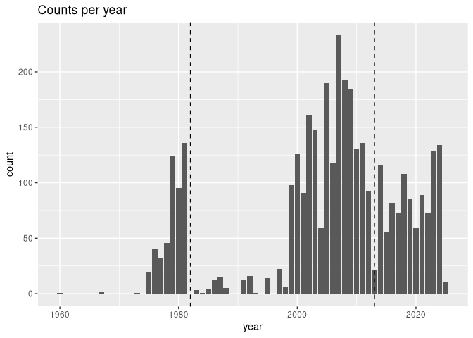
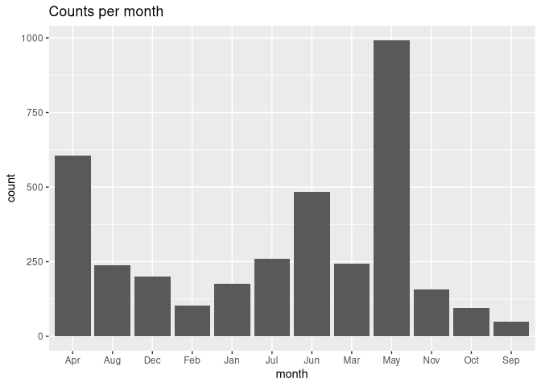
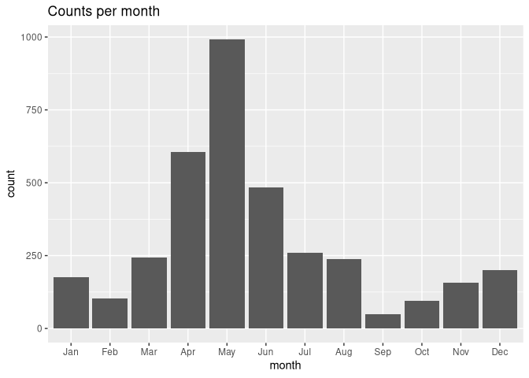
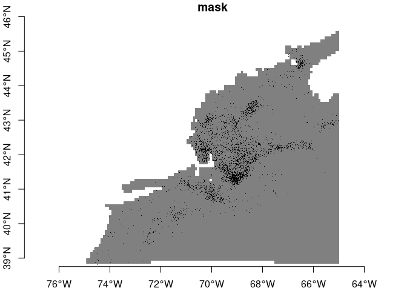
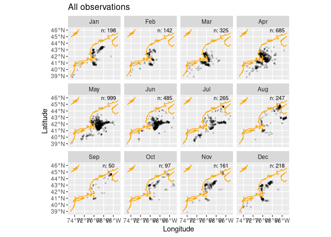
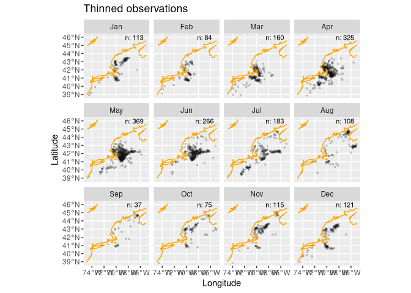
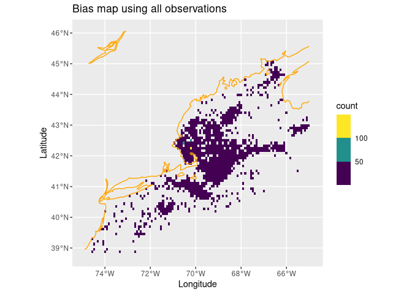
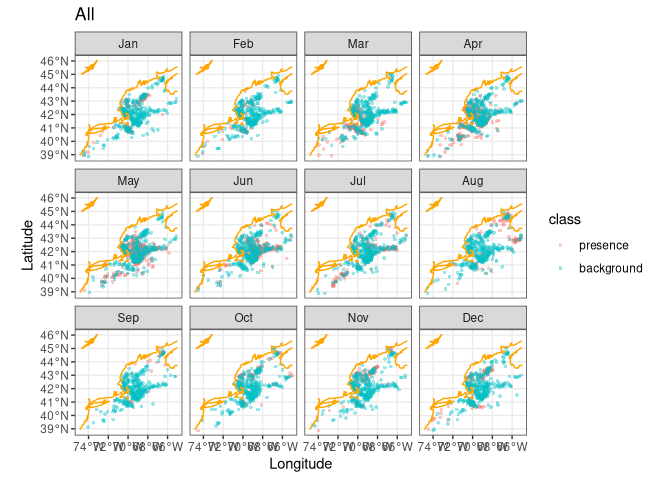
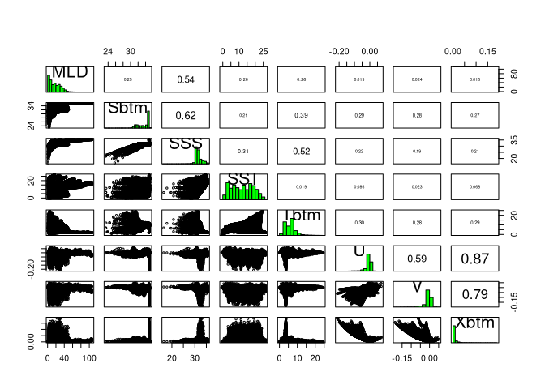

My Second Species
================

# Setting up

As always, I start by running our setup function. Start RStudio/R, and
reload my project with the menu `File > Recent Projects`.

``` r
source("setup.R")
SPECIES = "Eubalaena"
```

# Observations (reading in the observations I have already downloaded for that species.)

``` r
obs = read_obis(SPECIES)
obs
```

    ## Simple feature collection with 6075 features and 7 fields
    ## Geometry type: POINT
    ## Dimension:     XY
    ## Bounding box:  xmin: -74.583 ymin: 38.81521 xmax: -65.0203 ymax: 45.94406
    ## Geodetic CRS:  WGS 84
    ## # A tibble: 6,075 × 8
    ##    id             basisOfRecord eventDate   year month eventTime individualCount
    ##  * <chr>          <chr>         <date>     <dbl> <chr> <chr>               <dbl>
    ##  1 0010fede-89a5… HumanObserva… 2004-04-18  2004 Apr   17:40:38Z               1
    ##  2 001648b3-df39… HumanObserva… 2022-04-04  2022 Apr   21:01:46Z               5
    ##  3 004d9f18-2381… HumanObserva… NA            NA <NA>  <NA>                   NA
    ##  4 004fb1f0-1678… HumanObserva… NA            NA <NA>  <NA>                   NA
    ##  5 005b73cf-9745… HumanObserva… 2010-01-24  2010 Jan   15:24:26Z               4
    ##  6 0076b088-774e… HumanObserva… 1998-08-02  1998 Aug   18:22:19Z               1
    ##  7 008400f9-a1f3… HumanObserva… 2011-05-02  2011 May   16:17:43Z               1
    ##  8 00a2b378-a371… HumanObserva… 2007-10-26  2007 Oct   17:59:43Z               1
    ##  9 00a31509-00cd… HumanObserva… NA            NA <NA>  <NA>                   NA
    ## 10 00af01be-8cb8… HumanObserva… 2008-07-10  2008 Jul   20:24:09Z               8
    ## # ℹ 6,065 more rows
    ## # ℹ 1 more variable: geom <POINT [°]>

# using the `dim()` functions and returns the number of rows and number of columns.

``` r
dim_start = dim(obs)
dim_start
```

    ## [1] 6075    8

## basisOfRecord

Next I examine the `basisOfRecord` variable to get an understanding of
how these observations I made.

``` r
obs |> count(basisOfRecord)
```

    ## Simple feature collection with 3 features and 2 fields
    ## Geometry type: GEOMETRY
    ## Dimension:     XY
    ## Bounding box:  xmin: -74.583 ymin: 38.81521 xmax: -65.0203 ymax: 45.94406
    ## Geodetic CRS:  WGS 84
    ## # A tibble: 3 × 3
    ##   basisOfRecord              n                                              geom
    ## * <chr>                  <int>                                    <GEOMETRY [°]>
    ## 1 HumanObservation        5814 MULTIPOINT ((-65.20417 42.8235), (-65.2025 42.82…
    ## 2 MachineObservation       260 MULTIPOINT ((-70.54666 42.43668), (-70.54586 42.…
    ## 3 NomenclaturalChecklist     1                        POINT (-65.80602 44.97985)

# takeing a closer look at the complete records for one from each group.

``` r
human = obs |>
  filter(basisOfRecord == "HumanObservation") |>
  slice(1) |>
  browse_obis()
```

    ## Please point your browser to the following url:

    ## https://api.obis.org/v3/occurrence/0010fede-89a5-4a8c-a999-c559f70fb378

``` r
preserved = obs |>
  filter(basisOfRecord == "PreservedSpecimen") |>
  slice(1) |>
  browse_obis()
```

    ## Please point your browser to the following url:

    ## https://api.obis.org/v3/occurrence/NA

``` r
checklist = obs |>
  filter(basisOfRecord == "NomenclaturalChecklist") |>
  slice(1) |>
  browse_obis()
```

    ## Please point your browser to the following url:

    ## https://api.obis.org/v3/occurrence/3bee04d8-17ee-4ac4-90b3-a318d08aa672

``` r
occurrence = obs |>
  filter(basisOfRecord == "Occurrence") |>
  slice(1) |>
  browse_obis()
```

    ## Please point your browser to the following url:

    ## https://api.obis.org/v3/occurrence/NA

``` r
summary(obs)
```

    ##       id            basisOfRecord        eventDate               year     
    ##  Length:6075        Length:6075        Min.   :1960-06-08   Min.   :1960  
    ##  Class :character   Class :character   1st Qu.:2002-04-30   1st Qu.:2002  
    ##  Mode  :character   Mode  :character   Median :2008-06-13   Median :2008  
    ##                                        Mean   :2006-11-15   Mean   :2006  
    ##                                        3rd Qu.:2017-05-11   3rd Qu.:2017  
    ##                                        Max.   :2025-05-04   Max.   :2025  
    ##                                        NA's   :2200         NA's   :2200  
    ##     month            eventTime         individualCount              geom     
    ##  Length:6075        Length:6075        Min.   :  1.000   POINT        :6075  
    ##  Class :character   Class :character   1st Qu.:  1.000   epsg:4326    :   0  
    ##  Mode  :character   Mode  :character   Median :  2.000   +proj=long...:   0  
    ##                                        Mean   :  3.504                       
    ##                                        3rd Qu.:  3.000                       
    ##                                        Max.   :100.000                       
    ##                                        NA's   :2467

## `eventDate`

# Filtering those

``` r
obs = obs |>
  filter(!is.na(eventDate))
summary(obs)
```

    ##       id            basisOfRecord        eventDate               year     
    ##  Length:3875        Length:3875        Min.   :1960-06-08   Min.   :1960  
    ##  Class :character   Class :character   1st Qu.:2002-04-30   1st Qu.:2002  
    ##  Mode  :character   Mode  :character   Median :2008-06-13   Median :2008  
    ##                                        Mean   :2006-11-15   Mean   :2006  
    ##                                        3rd Qu.:2017-05-11   3rd Qu.:2017  
    ##                                        Max.   :2025-05-04   Max.   :2025  
    ##                                                                           
    ##     month            eventTime         individualCount              geom     
    ##  Length:3875        Length:3875        Min.   :  1.000   POINT        :3875  
    ##  Class :character   Class :character   1st Qu.:  1.000   epsg:4326    :   0  
    ##  Mode  :character   Mode  :character   Median :  2.000   +proj=long...:   0  
    ##                                        Mean   :  3.505                       
    ##                                        3rd Qu.:  3.000                       
    ##                                        Max.   :100.000                       
    ##                                        NA's   :271

\##`individualCount`if I have more `NA` values for `individualCount`.

``` r
obs |>
  filter(is.na(individualCount)) |>
  slice(1) |>
  browse_obis()
```

    ## Please point your browser to the following url:

    ## https://api.obis.org/v3/occurrence/03b2e7d4-e93a-4450-a22d-85faf7d36c15

# In the interest of time, I can also simply filter those out of our observation dataset.

``` r
obs = obs |>
  filter(!is.na(individualCount))
summary(obs)
```

    ##       id            basisOfRecord        eventDate               year     
    ##  Length:3604        Length:3604        Min.   :1960-06-08   Min.   :1960  
    ##  Class :character   Class :character   1st Qu.:2001-05-18   1st Qu.:2001  
    ##  Mode  :character   Mode  :character   Median :2007-11-20   Median :2007  
    ##                                        Mean   :2005-12-16   Mean   :2006  
    ##                                        3rd Qu.:2014-12-13   3rd Qu.:2014  
    ##                                        Max.   :2025-05-04   Max.   :2025  
    ##     month            eventTime         individualCount              geom     
    ##  Length:3604        Length:3604        Min.   :  1.000   POINT        :3604  
    ##  Class :character   Class :character   1st Qu.:  1.000   epsg:4326    :   0  
    ##  Mode  :character   Mode  :character   Median :  2.000   +proj=long...:   0  
    ##                                        Mean   :  3.505                       
    ##                                        3rd Qu.:  3.000                       
    ##                                        Max.   :100.000

\#Well now one has to wonder about a single observation of 25 animals.

``` r
obs |>
  filter(individualCount == 25) |>
  browse_obis()
```

    ## Please point your browser to the following url:

    ## https://api.obis.org/v3/occurrence/1ad0cbfb-434b-4b43-8b7f-6318f197943e

## making a plot of the counts per year, with dashed lines shown the Brickman “current” cliamtology period.

``` r
ggplot(data = obs,
       mapping = aes(x = year)) + 
  geom_bar() + 
  geom_vline(xintercept = c(1982, 2013), linetype = "dashed") + 
  labs(title = "Counts per year")
```

<!-- -->

``` r
obs = obs |>
  filter(year >= 1970)
dim(obs)
```

    ## [1] 3601    8

That’s still a lot of records. Now let’s check out the distribution
across the months of the year.

## I will be making models and predictions for each month of the for the 4 future projection climates. Species and observers do show some seasonality, but it that seasonality so extreme that it might be impossible to model some months because of sparse data? Let’s make a plot of the counts per month.

``` r
ggplot(data = obs,
       mapping = aes(x = month)) + 
  geom_bar() + 
  labs(title = "Counts per month")
```

<!-- -->

# By default `ggplot` plots in alpha-numeric order, which scrambles our month order. To fix that we have to convert the `month` in a factor type while specifying the order of the factors, and we’ll use the `mutate()` function to help us.

``` r
obs = obs |>
  mutate(month = factor(month, levels = month.abb))

ggplot(data = obs,
       mapping = aes(x = month)) + 
  geom_bar() + 
  labs(title = "Counts per month")
```

<!-- -->

That’s better!

## We need to load the Brickman database, and then filter it for the static variable called “mask”.

``` r
db = brickman_database() |>
  filter(scenario == "STATIC", var == "mask")
mask = read_brickman(db)
mask
```

    ## stars object with 2 dimensions and 1 attribute
    ## attribute(s):
    ##       Min. 1st Qu. Median Mean 3rd Qu. Max. NA's
    ## mask     1       1      1    1       1    1 4983
    ## dimension(s):
    ##   from  to offset    delta refsys point x/y
    ## x    1 121 -74.93  0.08226 WGS 84 FALSE [x]
    ## y    1  89  46.08 -0.08226 WGS 84 FALSE [y]

\#To see what our mask looks like with the observations drizzled on top.

``` r
plot(mask, breaks = "equal", axes = TRUE, reset = FALSE)
plot(st_geometry(obs), pch = ".", add = TRUE)
```

<!-- --> \#see some
that fall into no-data areas.

``` r
hitOrMiss = extract_brickman(mask, obs)
hitOrMiss
```

    ## # A tibble: 3,601 × 3
    ##    .id   name  value
    ##    <chr> <chr> <dbl>
    ##  1 p0001 mask      1
    ##  2 p0002 mask      1
    ##  3 p0003 mask      1
    ##  4 p0004 mask      1
    ##  5 p0005 mask      1
    ##  6 p0006 mask      1
    ##  7 p0007 mask      1
    ##  8 p0008 mask      1
    ##  9 p0009 mask      1
    ## 10 p0010 mask      1
    ## # ℹ 3,591 more rows

# tally the “value” variable.

``` r
count(hitOrMiss, value)
```

    ## # A tibble: 2 × 2
    ##   value     n
    ##   <dbl> <int>
    ## 1     1  3587
    ## 2    NA    14

# figuring out how many records we have dropped with all of this filtering.

``` r
dim_start = dim(obs)
obs = obs |>
  filter(!is.na(hitOrMiss$value))
dim_end = dim(obs)

dropped_records = dim_start[1] - dim_end[1]
dropped_records
```

    ## [1] 14

# Loading the data .

``` r
coast = read_coastline()
obs = read_observations(scientificname = "Eubalaena")
db = brickman_database() |>
  filter(scenario == "STATIC", var == "mask")
mask = read_brickman(db)
```

``` r
LON0 = -67
LAT0 = 46
all_counts = count(st_drop_geometry(obs), month) # counting is faster without spatial baggage
all_counts
```

    ## # A tibble: 12 × 2
    ##    month     n
    ##    <fct> <int>
    ##  1 Jan     198
    ##  2 Feb     142
    ##  3 Mar     325
    ##  4 Apr     685
    ##  5 May     999
    ##  6 Jun     485
    ##  7 Jul     265
    ##  8 Aug     247
    ##  9 Sep      50
    ## 10 Oct      97
    ## 11 Nov     161
    ## 12 Dec     218

``` r
ggplot() +
  geom_sf(data = obs, alpha = 0.2, shape = "circle small", size = 1) +
  geom_sf(data = coast, col = "orange") +
  geom_text(data = all_counts,
            mapping = aes(x = LON0, 
                          y = LAT0, 
                          label = sprintf("n: %i", .data$n)),
                          size = 3) + 
  labs(x = "Longitude", y = "Latitude", title = "All observations") +
  facet_wrap(~month)
```

<!-- -->

## Thinning observations

``` r
thinned_obs = sapply(month.abb,
               function(mon){ 
                 thin_by_cell(obs |> filter(month == mon), mask)
               }, simplify = FALSE) |>
  dplyr::bind_rows() 

# another count
thinned_counts = count(st_drop_geometry(thinned_obs), month)

ggplot() +
  geom_sf(data = thinned_obs, 
          alpha = 0.2, 
          shape = "circle small", 
          size = 1) +
  geom_sf(data = coast, col = "orange") +
  geom_text(data = thinned_counts,
            mapping = aes(x = LON0, 
                          y = LAT0, 
                          label = sprintf("n: %i", .data$n)),
                          size = 3) + 
  labs(x = "Longitude", y = "Latitude", title = "Thinned observations") +
  facet_wrap(~month)
```

<!-- -->

## Weighted sampling

``` r
bias_map = rasterize_point_density(obs, mask) # <-- note the original observations

ggplot() +
  geom_stars(data = bias_map, aes(fill = count)) +
  scale_fill_viridis_b(na.value = "transparent") +
  geom_sf(data = coast, col = "orange") + 
  labs(x = "Longitude", y = "Latitude", title = "Bias map using all observations")
```

<!-- -->

## Randomly sample background points

#### But just how many background points?

``` r
nback_avg = mean(all_counts$n) |>
  round()
nback_avg
```

    ## [1] 323

``` r
obsbkg = sapply(month.abb,
    function(mon){ 
      sample_background(thinned_obs |> filter(month == mon), # <- just this month
                       bias_map,
                       method = "bias",  # <-- it needs to know it's a bias map
                       return_pres = TRUE, # <-- give me the obs back, too
                       n = nback_avg) |>   # <-- how many points
        mutate(month = mon, .before = 1)
    }, simplify = FALSE) |>
  bind_rows() |>
  mutate(month = factor(month, levels = month.abb))
obsbkg 
```

    ## Simple feature collection with 5832 features and 2 fields
    ## Geometry type: POINT
    ## Dimension:     XY
    ## Bounding box:  xmin: -74.583 ymin: 38.86238 xmax: -65.02004 ymax: 45.07784
    ## Geodetic CRS:  WGS 84
    ## # A tibble: 5,832 × 3
    ##    month class                geometry
    ##  * <fct> <fct>             <POINT [°]>
    ##  1 Jan   presence   (-70.116 42.67433)
    ##  2 Jan   presence  (-69.9081 40.88898)
    ##  3 Jan   presence (-70.09733 41.00665)
    ##  4 Jan   presence (-70.37437 41.32246)
    ##  5 Jan   presence (-69.04631 42.84755)
    ##  6 Jan   presence (-70.19586 42.98453)
    ##  7 Jan   presence (-68.38264 43.20801)
    ##  8 Jan   presence (-70.07285 40.86119)
    ##  9 Jan   presence (-70.25719 42.84668)
    ## 10 Jan   presence (-68.37834 43.30294)
    ## # ℹ 5,822 more rows

``` r
# drop the spatial baggage to speed the tally
count(st_drop_geometry(obsbkg), month, class)
```

    ## # A tibble: 24 × 3
    ##    month class          n
    ##    <fct> <fct>      <int>
    ##  1 Jan   presence     113
    ##  2 Jan   background   323
    ##  3 Feb   presence      84
    ##  4 Feb   background   323
    ##  5 Mar   presence     160
    ##  6 Mar   background   323
    ##  7 Apr   presence     325
    ##  8 Apr   background   323
    ##  9 May   presence     369
    ## 10 May   background   323
    ## # ℹ 14 more rows

``` r
ggplot() +
  geom_sf(data = obsbkg, 
          mapping = aes(col = class),
          alpha =  0.4, shape = "circle small", size = 1) +
  geom_sf(data = coast, col = "orange")  + 
  labs(x = "Longitude", y = "Latitude", title = "All") +   
  theme_bw() +  # <- make a simple white background
  scale_fill_okabe_ito() +  # <-- colorblind friendly for N Record
  facet_wrap(~month)
```

<!-- -->

# saving this.

``` r
write_model_input(obsbkg, scientificname = "Eubalaena")
```

``` r
x = read_model_input(scientificname = "Eubalaena")
```

## Reading in the covariates

``` r
db = brickman_database() |>
  dplyr::filter(scenario == "PRESENT", interval == "mon")
present = read_brickman(db)
```

## Make a `pairs` plot

``` r
pairs(present)
```

<!-- -->

## Identify the most independent variables (and the most collinear)

``` r
keep = filter_collinear(present, method = "cor_caret", cutoff = 0.65)
keep
```

    ## [1] "SSS"  "U"    "Sbtm" "V"    "Tbtm" "MLD"  "SST" 
    ## attr(,"to_remove")
    ## [1] "Xbtm"

``` r
drop_me = attr(keep, "to_remove")
drop_me
```

    ## [1] "Xbtm"

``` r
keep = c("depth", "month", keep)
```

## A closer look at the model input data

``` r
model_input = read_model_input(scientificname = "Mola mola")
model_input
```

    ## Simple feature collection with 14521 features and 2 fields
    ## Geometry type: POINT
    ## Dimension:     XY
    ## Bounding box:  xmin: -74.72716 ymin: 38.84118 xmax: -65.00391 ymax: 45.1333
    ## Geodetic CRS:  WGS 84
    ## # A tibble: 14,521 × 3
    ##    month class                      geom
    ##    <fct> <fct>               <POINT [°]>
    ##  1 Jan   presence   (-69.62994 43.65584)
    ##  2 Jan   presence   (-72.05151 39.07928)
    ##  3 Jan   presence   (-67.79617 42.75941)
    ##  4 Jan   presence         (-71.31 41.49)
    ##  5 Jan   presence       (-71.989 39.668)
    ##  6 Jan   background (-72.75283 39.37328)
    ##  7 Jan   background (-70.28492 40.93629)
    ##  8 Jan   background (-68.72191 40.36045)
    ##  9 Jan   background (-72.09472 39.94913)
    ## 10 Jan   background (-66.25399 42.17025)
    ## # ℹ 14,511 more rows

``` r
present = read_brickman(add = c("depth"))
```

``` r
variables = extract_brickman(present, model_input, form = "wide")
variables
```

    ## Simple feature collection with 14521 features and 12 fields
    ## Geometry type: POINT
    ## Dimension:     XY
    ## Bounding box:  xmin: -74.72716 ymin: 38.84118 xmax: -65.00391 ymax: 45.1333
    ## Geodetic CRS:  WGS 84
    ## # A tibble: 14,521 × 13
    ##    .id    month class      depth   MLD  Sbtm   SSS   SST  Tbtm        U        V
    ##    <chr>  <fct> <fct>      <dbl> <dbl> <dbl> <dbl> <dbl> <dbl>    <dbl>    <dbl>
    ##  1 p00001 Jan   presence    80.6  31.9  32.7  31.4  3.76  5.68 -6.15e-3  3.85e-5
    ##  2 p00002 Jan   presence  2116.   45.9  35.0  33.3 10.9   3.72  7.56e-3 -6.58e-2
    ##  3 p00003 Jan   presence   192.   34.8  34.7  30.8  3.82  7.55  4.74e-3  1.64e-3
    ##  4 p00004 Jan   presence    13.6  10.7  30.9  30.8  4.57  4.66 -8.93e-4  2.45e-2
    ##  5 p00005 Jan   presence   231.   26.6  35.0  32.0  7.58  8.77 -3.48e-3 -4.36e-3
    ##  6 p00006 Jan   backgrou…   95.5  29.9  34.5  32.0  7.61 11.1   3.05e-3 -5.11e-3
    ##  7 p00007 Jan   backgrou…   38.6  37.0  31.1  31.1  5.14  5.17 -4.07e-3 -4.73e-3
    ##  8 p00008 Jan   backgrou…   91.2  25.1  34.2  31.3  6.17  9.08 -2.34e-3 -8.12e-3
    ##  9 p00009 Jan   backgrou…   87.7  32.2  33.9  31.6  6.83 10.4  -6.35e-3 -1.03e-2
    ## 10 p00010 Jan   backgrou…  155.   23.4  34.4  30.7  4.27  7.49  2.65e-2 -6.97e-4
    ## # ℹ 14,511 more rows
    ## # ℹ 2 more variables: Xbtm <dbl>, geom <POINT [°]>

``` r
variables = variables |>
  mutate(class = model_input$class) |>    # the $ extracts a column 
  select(-.id)                            # the minus means "deselect" or "drop"
variables
```

    ## Simple feature collection with 14521 features and 11 fields
    ## Geometry type: POINT
    ## Dimension:     XY
    ## Bounding box:  xmin: -74.72716 ymin: 38.84118 xmax: -65.00391 ymax: 45.1333
    ## Geodetic CRS:  WGS 84
    ## # A tibble: 14,521 × 12
    ##    month class     depth   MLD  Sbtm   SSS   SST  Tbtm        U        V    Xbtm
    ##    <fct> <fct>     <dbl> <dbl> <dbl> <dbl> <dbl> <dbl>    <dbl>    <dbl>   <dbl>
    ##  1 Jan   presence   80.6  31.9  32.7  31.4  3.76  5.68 -6.15e-3  3.85e-5 0.00219
    ##  2 Jan   presence 2116.   45.9  35.0  33.3 10.9   3.72  7.56e-3 -6.58e-2 0.0282 
    ##  3 Jan   presence  192.   34.8  34.7  30.8  3.82  7.55  4.74e-3  1.64e-3 0.00178
    ##  4 Jan   presence   13.6  10.7  30.9  30.8  4.57  4.66 -8.93e-4  2.45e-2 0.00896
    ##  5 Jan   presence  231.   26.6  35.0  32.0  7.58  8.77 -3.48e-3 -4.36e-3 0.00198
    ##  6 Jan   backgro…   95.5  29.9  34.5  32.0  7.61 11.1   3.05e-3 -5.11e-3 0.00211
    ##  7 Jan   backgro…   38.6  37.0  31.1  31.1  5.14  5.17 -4.07e-3 -4.73e-3 0.00222
    ##  8 Jan   backgro…   91.2  25.1  34.2  31.3  6.17  9.08 -2.34e-3 -8.12e-3 0.00301
    ##  9 Jan   backgro…   87.7  32.2  33.9  31.6  6.83 10.4  -6.35e-3 -1.03e-2 0.00431
    ## 10 Jan   backgro…  155.   23.4  34.4  30.7  4.27  7.49  2.65e-2 -6.97e-4 0.00971
    ## # ℹ 14,511 more rows
    ## # ℹ 1 more variable: geom <POINT [°]>

``` r
plot_pres_vs_bg(variables |> select(-month), "class")
```

<!-- -->

## Saving a file to keep track of modeling choices

``` r
cfg = list(
  version = "v1",
  scientificname = "Eubalaena",
  background = "average of observations per month",
  keep_vars =  keep)
```

``` r
cfg[['scientificname']]
```

    ## [1] "Eubalaena"

``` r
cfg[[2]]
```

    ## [1] "Eubalaena"

``` r
cfg$scientificname
```

    ## [1] "Eubalaena"

``` r
getElement(cfg, "scientificname")
```

    ## [1] "Eubalaena"

``` r
getElement(cfg, 2)
```

    ## [1] "Eubalaena"

``` r
ok = make_path(data_path("models")) # make a directory for models
write_configuration(cfg)            
```

``` r
write_model_input(variables, scientificname = "Eubalaena", version = "v1")
```
